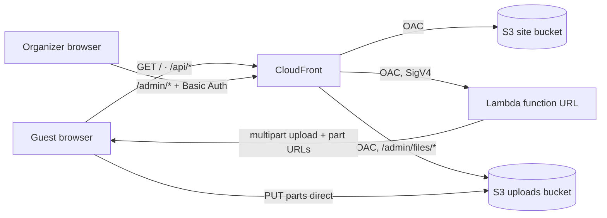

# Andreas' Memorial

A small, private web page for a memorial gathering. Guests scan a QR code, read a short notice
that their pictures will be shown in a slideshow, and upload photos and short videos from any
phone or computer browser. There's no app, no account and no gallery. Only the organizer can
retrieve the files, and then plays them as a slideshow at the gathering.

It runs serverless on AWS (S3, CloudFront, Lambda), is defined entirely in Terraform, and costs
cents for an event.

## Dedication

> *For Andreas.*
>
> This page was built in the days before the Lebensfeier for Andreas, a celebration of a life
> rather than a farewell to it. It was built so that everyone who loved Andreas could bring the
> moments they shared and see them together, one picture after another, in one room.
>
> Every photo uploaded here is a small piece of a long friendship. Thank you for all of them,
> Andreas.
>
> *Live long and prosper.* 🖖
>
> — Chris

The page carries Andreas' spirit in small ways: a portrait at the top, Spock's greeting
underneath, and the Vulcan salute as its logo.

## Donate

This project is free. No ads, no tracking, no premium tier, no "unlock five more photos for
€2.99". The code is MIT-licensed, and the AWS bill for a whole event is smaller than the tip for
the coffee you drink while reading this.

If you'd like to give something anyway, give it where it counts. Andreas was treated for cancer
at the Centrum für Integrierte Onkologie (CIO) at the University Hospital Bonn. Donations there
fund research, teaching and patient care, so that the people who come after Andreas get even
better treatment than medicine could offer Andreas.

**[🎗️ Donate to cancer care and research at CIO Bonn](https://www.ciobonn.de/cio-bonn/helfen-und-spenden)**

Donations are made by bank transfer. The page lists the account and the reference to use, and
the hospital issues donation receipts. This project receives nothing from any donation.

## Contents

- [Features](#features)
- [Similar Projects](#similar-projects)
- [Architecture](#architecture)
- [Costs](#costs)
- [Prerequisites](#prerequisites)
- [Deploying](#deploying)
- [Guest Usage](#guest-usage)
- [Retrieving Uploads](#retrieving-uploads)
- [Verification and Tests](#verification-and-tests)
- [Customizing](#customizing)
- [Security Model](#security-model)
- [Privacy](#privacy)
- [Troubleshooting](#troubleshooting)
- [Tearing Down](#tearing-down)
- [Known Limitations](#known-limitations)
- [License and Credits](#license-and-credits)

## Features

**For guests:**

- **No login, no account, no app.** It works in Safari, Chrome and Firefox on mobile and desktop.
- **Notice first:** the notice about the slideshow sits above the upload control.
- **One tap:** a single upload button opens the native photo library or file picker, and the
  upload starts as soon as files are chosen.
- **Formats:** photos in all common formats, including iPhone HEIC, plus short videos.
- **Name, optionally:** one free-text name field and nothing else. The name becomes part of the
  file name, so the slideshow folder shows who sent what.
- **Resumable uploads:** an interrupted file continues where it stopped, even after a reload,
  when the same file is picked again.
- **Clear feedback:** progress for each file, a confirmation, and an immediate "Nochmal
  versuchen" (try again) on failure that keeps the chosen files.
- **Easy to pass on:** a header button shows the page's QR code full-screen, so guests can pass
  the page on from their own screen.
- **Write-only:** guests cannot list, view or delete any upload, including their own.

**For the organizer:**

- **Admin page** behind HTTP Basic Auth, with a file list and "download all into a folder"
  (Chrome or Edge on desktop).
- **`download.sh`:** fetches everything into a local folder and converts HEIC to JPEG with the
  macOS built-in `sips`.
- **Upload deadline** after which new uploads are refused.
- **Deploy checks:** `publish.sh` checks that uploads really work before you print the QR code,
  and `verify.sh` runs a full security and end-to-end check.

**Limits (Terraform variables):**

| Setting | Default | Variable |
| --- | --- | --- |
| Files per upload | 20 | `max_files` |
| Size per photo | 50 MB | `max_photo_mb` |
| Size per video | 300 MB (about 2 min of iPhone 1080p) | `max_video_mb` |
| Upload cutoff | required | `upload_deadline` |

The page is in German and addresses guests informally ("du"). See
[Customizing](#customizing) to change texts or language.

## Similar Projects

Several good open-source projects collect photos from guests via a QR code. Most are built for
weddings or parties and include a shared gallery. They are worth a look if that fits better:

- [wedding-qr-album](https://github.com/Altatov05/wedding-qr-album): self-hosted and local-first;
  guests upload to your own computer.
- [EventSlide](https://github.com/Irony42/EventSlide): runs on one machine at the venue, with
  approval and live projection.
- [wedding-memories](https://github.com/shahboura/wedding-memories): a Next.js Docker container
  with local storage and a guest gallery.
- [our_gallery](https://github.com/SeaBoiii/our_gallery): Cloudflare Workers, R2 and D1, with
  moderated guest browsing.
- [our-wedding-gallery](https://github.com/eddmann/our-wedding-gallery): serverless on AWS,
  with presigned S3 POST and a WebP-resizing Lambda.
- [event-photo-share](https://github.com/lucafluri/event-photo-share) and
  [PicPeak](https://github.com/PicPeak/picpeak): self-hosted event galleries with guest uploads.

**What is different here:**

- **Write-only by design:** there is no gallery and no browsing, which suits a memorial, where
  the pictures are meant for the gathering and not for the internet.
- **Serverless and pay-per-use:** there is nothing to host or keep running, and it can be torn
  down after the event.
- **Resumable multipart uploads** for large phone videos over poor venue Wi-Fi.
- **Everything in Terraform,** with verification scripts for the security boundary.

## Architecture



**Request routing (one CloudFront distribution):**

| Path | Origin | Auth | Purpose |
| --- | --- | --- | --- |
| `/` and assets | site bucket | none | guest page |
| `/api/config` | Lambda | none | limits, part size, open or closed |
| `/api/upload`, `/api/upload/resume`, `/api/upload/complete` | Lambda | none | start, resume and finish multipart uploads |
| `/admin/` | site bucket | Basic Auth | admin page |
| `/admin/api/list` | Lambda | Basic Auth | object list |
| `/admin/files/<key>` | uploads bucket | Basic Auth | download (mapped to `uploads/<key>`) |

**Repository layout:**

| Path | Contents |
| --- | --- |
| `web/` | Pages as MkDocs Markdown, plus `javascripts/`, `stylesheets/`, `fonts/` and `images/` |
| `mkdocs.yml` | Theme and build configuration |
| `lambda/index.mjs` | The whole API, one file, Node.js 22 |
| `terraform/` | All infrastructure, plus the admin CloudFront Function (`admin-auth.js`) |
| `set-password.sh`, `publish.sh`, `verify.sh`, `download.sh` | Admin credential, build and publish, checks, bulk download |
| `tests/` | Offline tests for the API |
| `moon.yml`, `.moon/` | Optional task runner configuration |

**Design decisions:**

- **MkDocs Material for two pages:** it gives a polished, accessible look with a header, footer
  and admonitions for free, and builds with plain Python. The interactive part is two small
  vanilla ES modules. React, npm or a bundler would add a toolchain without adding anything
  functional. npm is only used for the offline tests.
- **Resumable S3 multipart uploads, not uploads through Lambda:**
  - Lambda caps request payloads at 6 MB, so file bytes never pass through the function.
  - Every file is one S3 multipart upload in 8 MiB parts. The browser PUTs each part straight
    to S3 with a presigned URL (valid 1 h), retries a failed part with backoff, and asks
    `/api/upload/resume` for fresh URLs and the list of stored parts when a URL expires.
  - **Resume:** the page remembers each started upload in `localStorage` by file fingerprint
    (name, size, modification time). "Nochmal versuchen", or picking the same file again after a
    reload, sends only the missing parts.
  - **Size enforcement:** each part URL signs its exact `Content-Length`, so S3 refuses a larger
    body. `/api/upload/complete` assembles the object only when the stored parts add up exactly
    to the announced size within the limit, and aborts the upload otherwise.
  - **Cleanup:** a lifecycle rule aborts multipart uploads that were never completed after
    1 day.
  - **Deadline:** new uploads stop at `upload_deadline`. Uploads already started may still
    resume and complete for 6 h afterwards.
  - **Signing:** part URLs are signed by hand (SigV4 query auth), because the presigner package
    is not guaranteed to ship with the Lambda runtime. `tests/` cross-checks the signature
    against the AWS SDK's `getSignedUrl`.
- **Regional S3 endpoint:** a brand-new bucket can answer the global endpoint with a 307
  redirect, which a cross-origin browser request cannot follow. Part URLs therefore target
  `<bucket>.s3.<region>.amazonaws.com`, so uploads work immediately after deployment.
- **Lambda function URL behind CloudFront OAC:** with `AWS_IAM` auth, the raw function URL answers
  403. Only the distribution can call it. OAC requires an `x-amz-content-sha256` body hash on
  every POST, which the page computes in the browser.
- **Basic Auth at the edge for the admin area:**
  - A CloudFront Function checks a SHA-256 digest of the credential. The password itself is never
    stored anywhere, and the check costs nothing.
  - Cognito would be heavy for one person, and IAM-gated access would need AWS keys in the
    browser.
  - All admin paths live below `/admin/`. Browsers resend a Basic Auth credential only for paths
    below the one that was authenticated (RFC 7617), so the admin page's own requests carry it
    without a second prompt.
- **HEIC is converted at download time:** there is no server-side conversion. iOS Safari often
  hands the page a JPEG anyway, and `download.sh` converts the rest with `sips`, keeping the
  originals.
- **Upload bucket without `force_destroy`:** a `terraform destroy` cannot delete the guests'
  photos by accident. See [Tearing Down](#tearing-down).
- **Light design only, for now:** many guests open the page at night. The dark palette is kept,
  commented out, in `mkdocs.yml`, together with instructions to switch it back on.

## Costs

For an event with about 500 uploads (roughly 5 GB), expect well under $1, plus about
$0.10–$0.50 per month while the files stay stored. The estimate is based on AWS list prices for
eu-central-1; check it in the [AWS Pricing Calculator](https://calculator.aws/).

- **S3:** storage (about $0.025 per GB-month) and request charges of about a cent. Upload
  traffic into S3 is free.
- **Lambda, CloudFront and the CloudFront Function:** within the always-free monthly
  allowances at this scale.
- **Domain:** the default `*.cloudfront.net` address needs no domain, Route 53 zone or
  certificate.
- **Stopping the cost:** empty the uploads bucket and run `terraform destroy`. Nothing charges by
  the hour.

## Prerequisites

**Tools (macOS; Linux works for everything except the HEIC conversion):**

- [Terraform](https://developer.hashicorp.com/terraform/install) ≥ 1.5, or OpenTofu.
- [AWS CLI v2](https://docs.aws.amazon.com/cli/latest/userguide/getting-started-install.html),
  version 2.32 or newer if you sign in with `aws login`.
- Python 3.10 or newer, for the MkDocs build.
- Node.js 22 or newer, only for the offline tests.
- Optional: [moon](https://moonrepo.dev/docs/install) as task runner, and `qrencode` for the QR
  code image.

**Python environment (once, from the project root):**

```zsh
python3 -m venv .venv
```

```zsh
.venv/bin/pip install -r requirements.txt
```

**AWS account:** an identity with administrator rights in the account you deploy to. Everything
is created in `eu-central-1` (Frankfurt) by default; set `aws_region` to change it before the
first `apply`.

### AWS Credentials

Before deploying or downloading, you need a valid session for your AWS profile, and that profile
selected in the shell. Replace `<admin-profile>` with your own profile name.

1. Sign in. `aws login` opens a browser for the console sign-in, and the session lasts at most
   12 hours. With IAM Identity Center, use `aws sso login` instead.

   ```zsh
   aws login --profile <admin-profile>
   ```

2. Select the profile for this shell. The scripts, Terraform and moon tasks inherit it.

   ```zsh
   export AWS_PROFILE=<admin-profile>
   ```

3. Check which account and identity are in use:

   ```zsh
   aws sts get-caller-identity
   ```

**Notes:**

- **Why both steps:** `aws login` only refreshes the session of the named profile. Without
  `AWS_PROFILE`, every tool falls back to the `default` profile, which may be a different
  identity or region.
- **Session expiry:** after the session ends, commands fail with `ExpiredToken`; sign in again.
  The deployed page never depends on your session, because uploads use the Lambda's own role.
- **Root user:** if the ARN ends in `:root`, you are signed in as the account root user. That
  works, but an IAM user with administrator rights is the safer identity.

## Deploying

**Steps (from the project root):**

1. Set the admin credential. Only a SHA-256 digest is written, to `terraform/auth.auto.tfvars`.
   Store the password in your password manager, because it cannot be recovered.

   ```zsh
   ./set-password.sh
   ```

2. Create your settings from the example. `terraform.tfvars` is git-ignored, so names and dates
   stay out of the repository.

   ```zsh
   cp terraform/terraform.tfvars.example terraform/terraform.tfvars
   ```

   Then edit `upload_deadline`, `event_title` and `footer_text`.

3. Initialize and review the plan. `init` downloads the AWS provider, which takes about 800 MB.

   ```zsh
   terraform -chdir=terraform init
   ```

   ```zsh
   terraform -chdir=terraform plan
   ```

4. Apply. Creating the CloudFront distribution takes about 5–15 minutes, and the command
   returns once it is deployed.

   ```zsh
   terraform -chdir=terraform apply
   ```

5. Add the two personal images to `web/images/`. Both are git-ignored and published with the
   pages. The page works without them, but should not go to the event that way.

   - **`portrait.jpg`:** the photo shown at the top of the guest page. About 1000 px wide is
     plenty. Remove location data first: in Preview, choose Tools → Show Inspector → GPS →
     Remove Location Info. If it is not 1086 × 1233 px, update the `width` and `height` in
     `web/index.md` and the `aspect-ratio` of `.mu-portrait img` in
     `web/stylesheets/memorial.css`, so the page does not jump while the image loads.

   - **`qr.png`:** the QR code the header button shows. It encodes this deployment's address, so
     create it after `apply`. Any square PNG works. With `qrencode` (`brew install qrencode`):

     ```zsh
     qrencode -s 12 -o web/images/qr.png "$(terraform -chdir=terraform output -raw site_url)/"
     ```

     Keep the default margin (`-m 4`). QR scanners need that quiet zone, especially on print.

6. Build and publish. The script fails unless `/api/config` answers with uploads open, and it
   warns while `portrait.jpg` or `qr.png` is missing.

   ```zsh
   ./publish.sh
   ```

7. Verify. With the credential, this also makes one real multipart upload and removes it again.
   It includes a part of the wrong length, which S3 must refuse.

   ```zsh
   MEMORIAL_CREDENTIAL='<user>:<password>' ./verify.sh
   ```

   Use the username and password from `set-password.sh`, not your AWS credentials.

8. Open the page on a phone, tap the QR button, and scan the code from a second phone. Print
   the same `qr.png` for cards or a sign at the venue.

**The address to share:**

```zsh
terraform -chdir=terraform output -raw site_url
```

**Changing settings later:**

- **Deadline:** edit `terraform.tfvars` and run `terraform apply`. No publish is needed.
- **Title or footer:** edit `terraform.tfvars`, run `terraform apply`, then run `./publish.sh`.
  Both are baked into the pages at build time.
- **Page texts, portrait, QR code:** edit the files and run `./publish.sh`.

**Moon tasks (optional):**

| Task | Equivalent |
| --- | --- |
| `moon run memorial:build` | `.venv/bin/mkdocs build --clean --strict` |
| `moon run memorial:serve` | Local preview on `http://127.0.0.1:8001`. There is no API locally, so the page reports the service as unreachable. |
| `moon run memorial:infra-plan` | `terraform -chdir=terraform plan`. There is deliberately no apply task. |
| `moon run memorial:publish` | `./publish.sh` |
| `moon run memorial:verify` | `./verify.sh` |
| `moon run memorial:download -- <folder>` | `./download.sh <folder>` |
| `moon run memorial:test` | `npm test` |

## Guest Usage

1. Scan the QR code, and the page opens in the phone's browser.
2. Optionally enter a name.
3. Tap **Fotos & Videos hochladen** and choose up to 20 photos or videos. The upload starts
   immediately, with progress for each file. While it runs, the page keeps the screen awake
   where the browser supports it.
4. **Success:** "Danke dir! … angekommen", and the button changes to "Noch mehr Fotos & Videos
   hochladen".
5. **Failure** (for example, the Wi-Fi drops): short drops are retried automatically. If a file
   still fails, the list shows how much is already stored, and **Nochmal versuchen** continues
   from there. After a reload, picking the same file again continues it too.
6. **Passing it on:** the QR button in the header shows the code full-screen.

## Retrieving Uploads

**Bulk download (recommended for the slideshow):**

```zsh
./download.sh ~/Desktop/slideshow
```

- **What it does:** runs `aws s3 sync` on `uploads/` into the folder, converts HEIC/HEIF to JPEG
  with `sips`, and keeps the originals in `_heic-originals/`.
- **Re-running:** safe at any time. Only new files are fetched or converted.
- **Result:** point your slideshow tool at the folder. File names start with the upload time in
  UTC, so they sort chronologically.

**Admin page** (`<site_url>/admin/`, which prompts for the credential):

- **Contents:** file count, total size, and a download link for each file.
- **"Alle in einen Ordner herunterladen":** saves everything into a folder you choose and skips
  files already there. It needs the File System Access API, which means Chrome or Edge on a
  desktop. Other browsers get the per-file links.
- **HEIC:** files saved from the page are not converted. The page shows the `sips` one-liner.

## Verification and Tests

**Offline tests (no AWS needed):**

```zsh
npm install
```

```zsh
npm test
```

The API runs against an in-memory S3 mock. The checks cover the limits, file types, key format,
resume and complete logic, the upload deadline and its grace period, input validation, and a
signature cross-check against the AWS SDK presigner. The access keys used there are AWS's
documented example keys, not real credentials.

**After deploying (`./verify.sh`):**

- **Guest side:** the page and API answer, uploads are open, and oversized, non-media and forged
  requests are refused. The page references no Google Fonts.
- **Admin area:** every admin path returns 401 without a credential or with a wrong one.
- **Isolation:** neither bucket nor the raw Lambda URL is reachable directly, HTTP redirects to
  HTTPS, and the security headers are present.
- **With a credential:** the admin page and list load, and a real multipart upload goes through
  end to end. A part of the wrong length is refused.

**Manual, before the event:**

1. iPhone Safari: upload a HEIC photo and a short video.
2. Android Chrome: upload a photo.
3. Desktop Firefox or Safari: upload a photo from the file system.
4. Run `./download.sh` and open the folder in your slideshow tool. Check that the converted JPEGs
   and the videos play.

## Customizing

| What | Where |
| --- | --- |
| Header title, footer, deadline, limits, region | `terraform/terraform.tfvars` |
| Notice, headings, form labels, quotation | `web/index.md` |
| Upload messages shown to guests | `web/javascripts/upload.js` |
| Server error messages shown to guests | `lambda/index.mjs` |
| Portrait, QR code, favicon | `web/images/` |
| Layout and component styles | `web/stylesheets/memorial.css` |
| Fonts (self-hosted Roboto, Latin subsets) | `web/fonts/`, `web/stylesheets/fonts.css` |
| Color palette (light and dark) | `web/stylesheets/colors.css` |
| Theme, logo icon, dark mode | `mkdocs.yml` |

**Changing the language:** translate the three text sources above (`web/index.md`,
`upload.js`, `lambda/index.mjs`) and set `theme.language` in `mkdocs.yml`, which controls
Material's own labels. The admin page texts are in `web/admin/index.md` and
`web/javascripts/admin.js`.

## Security Model

**What guests can do:**

- Guests can only start, continue and complete their own uploads. S3 keys are generated by the
  server, and resuming or completing requires the matching, unguessable multipart `uploadId`.
- They cannot list, read, overwrite or delete anything. The Lambda role has no `GetObject` or
  `DeleteObject`, and neither bucket is public.

**How the limits hold:**

- The size limits are enforced by S3 (a signed `Content-Length` per part) and again at
  completion. File types come from an allowlist of photo and video extensions, and the stored
  `Content-Type` is set by the server.

**The admin area:**

- Basic Auth over HTTPS, checked at the edge before any request reaches an origin. It is only as
  strong as the password: `set-password.sh` requires 12 or more characters, and a generated one
  is recommended (`openssl rand -base64 24`).

**Headers and data:**

- A strict response-headers policy: CSP, HSTS, `nosniff`, a referrer policy and frame options.
  `'unsafe-inline'` is needed for Material's inline scripts.
- Nothing personal is in the repository: the credential digest, names, deadline, portrait and QR
  code are all git-ignored.

**Not included:**

- There is no per-IP rate limiting. Abuse is bounded by the deadline, the per-request file cap
  and the size limits, so share the QR code only with guests.
- AWS WAF with a rate-based rule is the proper addition if you need rate limiting. At the time
  of writing it cost about $5 per web ACL per month plus $1 per rule, prorated hourly.

## Privacy

**What is stored:**

- Uploaded files and the optional name, in your own S3 bucket in the region you chose. Nothing is
  shared with third parties.
- Lambda logs contain only unexpected errors, never request bodies, and are kept for 14 days.

**No third parties:**

- The pages load nothing from other servers. Guests' browsers talk only to your CloudFront
  distribution and your own S3 bucket.
- **Fonts are self-hosted:** Material for MkDocs normally loads Roboto from Google Fonts, which
  would send each guest's IP address to Google. In the EU that can be a GDPR issue: a German
  court found embedding Google Fonts this way without consent unlawful (LG München I,
  20 January 2022, 3 O 17493/20).
- **How it's done:** `mkdocs.yml` sets `font: false`, and the same Roboto and Roboto Mono files
  are served from `web/fonts/` through `web/stylesheets/fonts.css`, so the look is unchanged.
  The CSP (`terraform/main.tf`) allows fonts only from the page's own origin, and `verify.sh`
  fails if the page references Google Fonts again.

**Tell your guests:** the notice on the page says who will see the pictures and where. Adjust it
to your event.

## Troubleshooting

- **`publish.sh` fails with "does not answer":** check the function's CloudWatch log group
  `/aws/lambda/<name_prefix>-api`. A 403 from CloudFront right after `apply` usually means the
  Lambda permissions or OAC have not propagated yet; wait a minute and re-run.
- **`publish.sh` fails with "uploads are closed":** `upload_deadline` is in the past or mistyped.
  Fix it in `terraform.tfvars` and `apply`.
- **`verify.sh` fails the admin checks:** `MEMORIAL_CREDENTIAL` must be the Basic Auth
  `user:password` from `set-password.sh`. After changing the password, run `terraform apply`.
- **Guests see "Upload abgelaufen":** the unfinished upload was cleaned up (after a day) or
  aborted. "Nochmal versuchen" starts that file again.
- **No portrait, or "QR-Code kommt noch":** the image was missing in `web/images/` at publish
  time. Add it and publish again.
- **`ExpiredToken` or `AccessDenied` from the AWS CLI or Terraform:** sign in again, and check
  that `AWS_PROFILE` is set. See [AWS Credentials](#aws-credentials).

## Tearing Down

1. Download everything and check the folder.
2. Empty the uploads bucket. This is irreversible.

   ```zsh
   aws s3 rm "s3://$(terraform -chdir=terraform output -raw uploads_bucket)" --recursive
   ```

3. Remove all resources.

   ```zsh
   terraform -chdir=terraform destroy
   ```

Until then, the only ongoing cost is S3 storage for the uploads.

## Known Limitations

- **Resume granularity:** an interrupted part (up to 8 MiB) is re-sent in full. Resuming after a
  reload needs the same file to be picked again in the same browser.
- **No rate limiting:** see [Security Model](#security-model).
- **No content check:** the extension and `Content-Type` are checked, but not the file's bytes.
  Files are served for download only, with `nosniff`, so a disguised file cannot run in the
  browser.
- **No video transcoding:** check that your slideshow tool plays iPhone HEVC `.mov` files.
- **No thumbnails on the admin page.**
- **One admin identity:** publishing uses your admin profile. There is no dedicated deploy
  IAM user.
- **Local preview has no API:** `moon run memorial:serve` shows the layout only.

## License and Credits

- **Author:** Chris, built with the help of AI, in memory of a dear friend, Andreas.
- **License:** this project is under the [MIT License](LICENSE).
- **Credits:** the pages are set in Roboto, self-hosted under the SIL Open Font License 1.1, and
  built with [MkDocs](https://www.mkdocs.org) and
  [Material for MkDocs](https://squidfunk.github.io/mkdocs-material/). The Vulcan-salute logo and
  favicon are the `hand-spock` icon from [Font Awesome Free](https://fontawesome.com), licensed
  under [CC BY 4.0](https://creativecommons.org/licenses/by/4.0/). The QR icon is from
  [Material Design Icons](https://pictogrammers.com/library/mdi/).
- **Third-party notices:** all third-party components and their licenses are listed in
  [THIRD-PARTY-NOTICES.md](THIRD-PARTY-NOTICES.md).

*"Live long and prosper"* is Spock's greeting from *Star Trek*. It is quoted here as a personal
tribute, and this project has no affiliation with the franchise.
